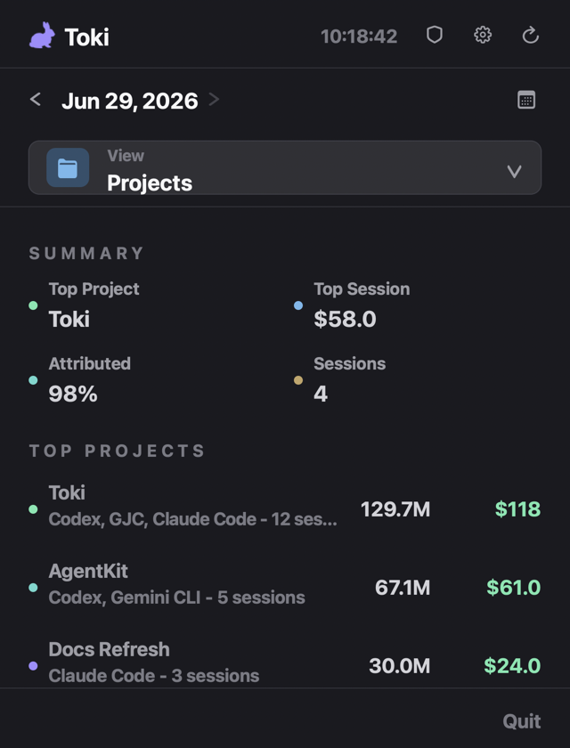

# Toki

[](https://github.com/choi138/toki/actions/workflows/ci.yml)


Toki is a local-first macOS menu bar app for tracking token usage, cost,
project attribution, and AI work time across Claude Code, Codex, Cursor,
Gemini CLI, GJC, OpenCode, and OpenClaw.

It reads each tool's local usage store, keeps the data on your machine, and
gives you a single popover for daily totals, date ranges, exports, and security
checks.

---

## Screenshots

| Overview | Projects | Models |
| --- | --- | --- |
|  |  |  |

| Sources | Time | Hourly |
| --- | --- | --- |
|  |  |  |

---

## What It Tracks

- **Daily and ranged usage**: total, input, output, cache read/write, reasoning
  tokens, cache hit rate, and estimated cost.
- **Projects and sessions**: cost and token attribution when logs expose enough
  project or session context.
- **Models**: per-model token totals, cost estimates, active time, and
  unpriced/context-only rows.
- **Sources**: per-agent totals, reader status diagnostics, and CSV/JSON copy
  exports.
- **Work time**: direct main-agent time, delegated subagent time, wall-clock
  overlap, stream counts, and parallel multiplier.
- **Hourly usage**: active hours, peak hour, average active hour, and top-hour
  rows.
- **Local security audit**: masked findings for API keys, access tokens, cloud
  credentials, JWTs, private key blocks, and secret assignments.

## Supported Agents

Toki auto-detects the default local data locations below. No account login or
cloud sync is required.

| Agent | Usage data source | Notes |
| --- | --- | --- |
| **Claude Code** | `~/.claude/projects/**/*.jsonl` | Deduplicates request/message usage and caches parsed logs locally. |
| **Codex** | `~/.codex/state_5.sqlite` plus discovered rollout JSONL files | Reconstructs ranged usage from rollout token-count snapshots. |
| **Cursor** | `~/Library/Application Support/Cursor/User/globalStorage/state.vscdb` | Exact token rows are counted when present; context-window metrics are shown separately when exact tokens are unavailable. |
| **Gemini CLI** | `~/.gemini/tmp/*/chats/**/*.json` | Reads current and legacy Gemini chat history formats. |
| **GJC** | `~/.gjc/agent/sessions/**/*.jsonl` | Reads local JSONL sessions, including assistant and delegated task token usage plus recorded cost. |
| **OpenCode** | `~/.local/share/opencode/opencode.db` | Reads assistant message token rows from SQLite. |
| **OpenClaw** | `~/.openclaw/agents/**/*.jsonl` | Reads assistant usage records from local agent logs. |

## Privacy And Data Notes

- Toki reads local files directly and does not upload usage logs, databases, or
  audit findings.
- Security audit evidence is masked in the UI.
- Costs are estimates from bundled model pricing. Unknown prices remain visible
  as unpriced rows instead of being silently folded into totals.
- Project/session attribution depends on what each agent records locally; rows
  with weaker attribution are marked as inferred or unknown.

## Controls

- Click the menu bar icon to open the usage popover.
- Use the date picker for a single day or custom date range.
- Use the shield button to run the local security audit.
- Use settings to choose a refresh interval, enable or disable readers, show
  zero-value source rows, and launch Toki at login.
- Use the refresh button for an immediate read; otherwise Toki refreshes on the
  configured interval.

---

## Requirements

- macOS 13.0 or later
- Xcode 15 or later for local development
- [XcodeGen](https://github.com/yonaskolb/XcodeGen) (`brew install xcodegen`)
- [SwiftLint](https://github.com/realm/SwiftLint) (`brew install swiftlint`)
- [SwiftFormat](https://github.com/nicklockwood/SwiftFormat) (`brew install swiftformat`)
- Apple Developer account only when producing signed/notarized release builds

## Getting Started

Download a release artifact from
[GitHub Releases](https://github.com/choi138/toki/releases), or build locally:

```bash
git clone https://github.com/choi138/toki.git
cd toki
brew install xcodegen swiftlint swiftformat
xcodegen generate
open Toki.xcodeproj
```

Then build and run the `Toki` scheme in Xcode.

## Development

Toki is organized by responsibility:

- `Toki/App`: menu bar lifecycle and app entry points.
- `Toki/Domain`: usage/security models, aggregation builders, formatting, and
  export payloads.
- `Toki/Infrastructure`: local file/database readers, pricing, activity
  estimation, and security scanning.
- `Toki/Features`: SwiftUI panels, settings, view models, exports, and audit UI.
- `TokiTests`: focused unit tests for readers, aggregation, formatting,
  settings, security audit behavior, and view-model logic.

Required checks before opening a PR:

```bash
swiftformat . --lint
swiftlint lint --strict --quiet
xcodegen generate
xcodebuild test \
  -project Toki.xcodeproj \
  -scheme TokiTests \
  -destination "platform=macOS" \
  CODE_SIGN_IDENTITY="" \
  CODE_SIGNING_REQUIRED=NO \
  CODE_SIGNING_ALLOWED=NO
```

CI runs formatting, linting, XcodeGen, build, and test steps on macOS.

## Release

Releases are built by the GitHub Actions **Release** workflow. Run it manually
with `workflow_dispatch` to produce workflow artifacts, or push a version tag
such as `v1.1.0` to publish a GitHub Release.

The workflow regenerates the Xcode project, archives the Release configuration,
exports `Toki.app`, packages the app and dSYM ZIPs, and can optionally sign and
notarize the app.

Required signing secrets are `BUILD_CERTIFICATE_BASE64`, `P12_PASSWORD`,
`KEYCHAIN_PASSWORD`, `DEVELOPMENT_TEAM`, and `CODE_SIGN_IDENTITY`. Optional
secrets are `PROVISIONING_PROFILE_BASE64`, `NOTARY_APPLE_ID`,
`NOTARY_PASSWORD`, and `NOTARY_TEAM_ID`.

## Tech Stack

- Swift 5.9
- SwiftUI and Charts
- SQLite3
- XcodeGen
- SwiftFormat and SwiftLint
- macOS 13.0+

## License

MIT — see [LICENSE](./LICENSE) for details.
