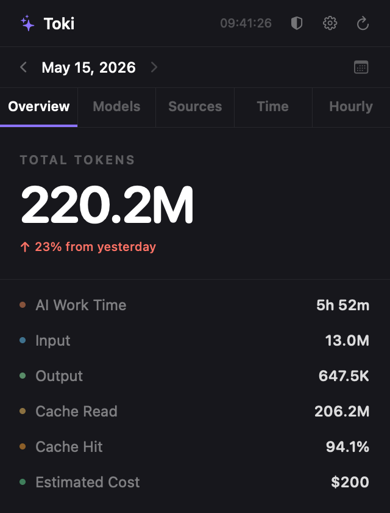
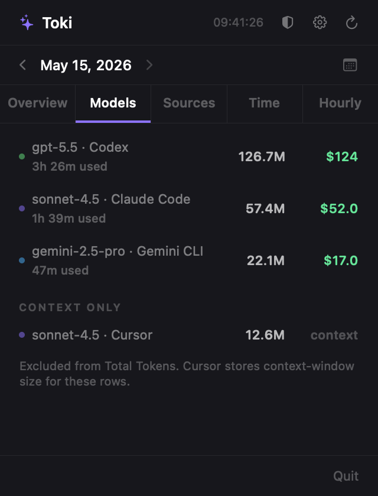
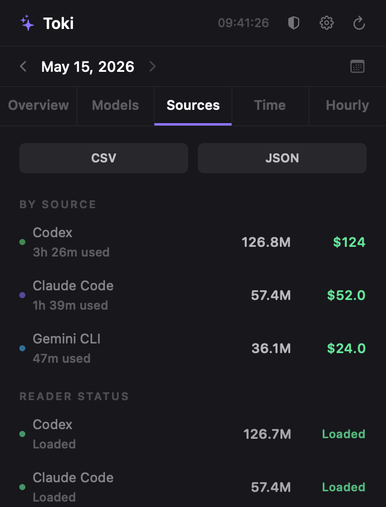
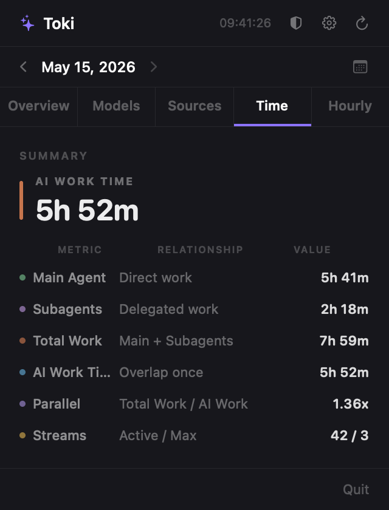
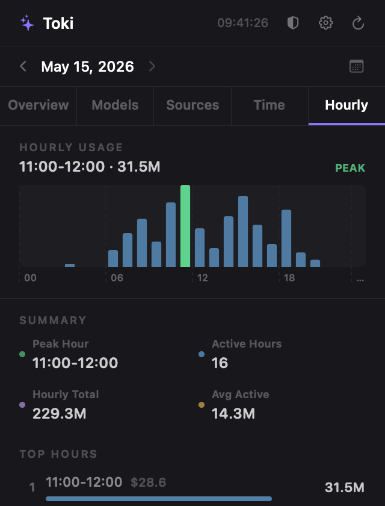

# Toki


A macOS menu bar app that tracks daily token usage and costs across multiple AI coding agents — all in one place.

---

## Screenshots

| Overview | Models | Sources |
|---|---|---|
|  |  |  |

| Time | Hourly |
|---|---|
|  |  |

---

## Features

- **Menu bar access** — click the white rabbit icon in the status bar to open a popover
- **Overview tab** — see Total Tokens, Input, Output, Cache Read, Cache Hit, and Cost at a glance
- **Models tab** — break down token usage and cost per model
- **Sources tab** — compare usage by agent, copy CSV/JSON exports, and inspect reader status
- **Time tab** — compare main-agent, subagent, wall-clock, and parallel work time
- **Hourly tab** — inspect hourly token usage, peak hour, active hours, and top-hour rows
- **Local security audit** — scan AI agent logs for masked secrets such as API keys, access tokens, cloud credentials, JWTs, and private key markers
- **Date selection** — pick a single day or a custom date range
- **Settings** — adjust refresh interval, enable/disable readers, and launch at login
- **Trend comparison** — ↑↓ indicators show how today compares to yesterday
- **Auto-refresh** — data updates every 3 minutes automatically
- **Manual refresh** — hit the refresh button to update on demand
- **Last updated** — always know when the data was last fetched
- **Shimmer skeleton UI** — smooth loading state while data is being fetched

---

## Supported Agents

Toki automatically detects usage data from the following agents:

| Agent | Data Source |
|---|---|
| **Claude Code** | `~/.claude/projects/**/*.jsonl` |
| **Codex** | `~/.codex/state_5.sqlite` |
| **Cursor** | `~/Library/Application Support/Cursor/User/globalStorage/state.vscdb` |
| **OpenCode** | `~/.local/share/opencode/opencode.db` |
| **Gemini CLI** | `~/.gemini/tmp/*/chats/**/*.json` |
| **OpenClaw** | `~/.openclaw/agents/**/*.jsonl` |

No configuration needed — Toki reads from each agent's default data directory.

---

## Requirements

- macOS 13.0 or later
- Xcode 15 or later
- [XcodeGen](https://github.com/yonaskolb/XcodeGen) (`brew install xcodegen`)
- [SwiftLint](https://github.com/realm/SwiftLint) (`brew install swiftlint`)
- [SwiftFormat](https://github.com/nicklockwood/SwiftFormat) (`brew install swiftformat`)
- Apple Developer account (for code signing)

CI runs `swiftlint lint --strict` and `swiftformat . --lint`, so local installs
of the same tooling are recommended before opening a PR.

---

## Getting Started

```bash
git clone https://github.com/choegeun-won/Toki.git
cd Toki
brew install xcodegen swiftlint swiftformat
xcodegen generate
open Toki.xcodeproj
```

Then build and run the scheme in Xcode.

---

## Development Conventions

Swift has official [API Design Guidelines](https://www.swift.org/documentation/api-design-guidelines/),
but no single mandatory Apple formatting style. Toki follows the local
SwiftFormat and SwiftLint configuration in this repository.

- Use 4 spaces and keep lines near 120 columns.
- Use `lowerCamelCase` for values/functions and `UpperCamelCase` for types.
- Keep SwiftUI views small; move domain logic out of `body` implementations.
- Reuse cached formatters for repeated date, number, and currency formatting.

Required checks before opening a PR:

```bash
swiftformat . --lint
swiftlint lint --strict --quiet
xcodegen generate
xcodebuild test \
  -project Toki.xcodeproj \
  -scheme Toki \
  -destination "platform=macOS" \
  CODE_SIGN_IDENTITY="" \
  CODE_SIGNING_REQUIRED=NO \
  CODE_SIGNING_ALLOWED=NO
```

---

## Release

Releases are built by the GitHub Actions **Release** workflow. Run it manually
from Actions with `workflow_dispatch`, or push a version tag such as `v1.0.1`.
The workflow regenerates the Xcode project with XcodeGen, archives the Release
scheme, exports `Toki.app`, and uploads zipped app and dSYM artifacts.

Unsigned artifacts are produced when signing secrets are not configured. To
build a signed, notarization-ready archive, configure these repository secrets:
`BUILD_CERTIFICATE_BASE64`, `P12_PASSWORD`, `KEYCHAIN_PASSWORD`,
`DEVELOPMENT_TEAM`, and `CODE_SIGN_IDENTITY`. Optional secrets are
`PROVISIONING_PROFILE_BASE64` for a provisioning profile and `NOTARY_APPLE_ID`,
`NOTARY_PASSWORD`, `NOTARY_TEAM_ID` for notarization submission.

---

## Tech Stack

- **Swift / SwiftUI**
- **XcodeGen** — project file generation from `project.yml`
- **macOS 13.0+**

---

## License

MIT — see [LICENSE](./LICENSE) for details.
