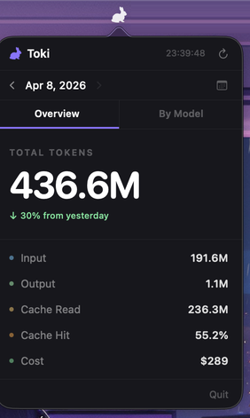
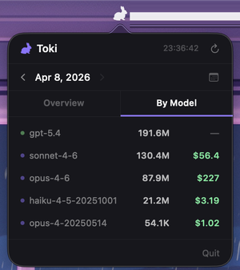

# Toki


A macOS menu bar app that tracks daily token usage and costs across multiple AI coding agents — all in one place.

---

## Screenshot

<p align="center">
  
  &nbsp;&nbsp;&nbsp;&nbsp;
  
</p>

---

## Features

- **Menu bar access** — click the white rabbit icon in the status bar to open a popover
- **Overview tab** — see Total Tokens, Input, Output, Cache Read, Cache Hit, and Cost at a glance
- **By Model tab** — break down token usage and cost per model
- **Date selection** — pick a single day or a custom date range
- **Trend comparison** — ↑↓ indicators show how today compares to yesterday
- **Auto-refresh** — data updates every 3 minutes automatically
- **Manual refresh** — hit the refresh button to update on demand
- **Last updated** — always know when the data was last fetched
- **Shimmer skeleton UI** — smooth loading state while data is being fetched

---

## Supported Agents

Toki automatically detects usage data from the following agents:

| Agent | Data Source |
|---|---|
| **Claude Code** | `~/.claude/projects/**/*.jsonl` |
| **Codex** | `~/.codex/state_5.sqlite` |
| **OpenCode** | `~/.local/share/opencode/opencode.db` |
| **Gemini CLI** | `~/.gemini/tmp/*/chats/**/*.json` |
| **OpenClaw** | `~/.openclaw/agents/**/*.jsonl` |

No configuration needed — Toki reads from each agent's default data directory.

---

## Requirements

- macOS 13.0 or later
- Xcode 15 or later
- [XcodeGen](https://github.com/yonaskolb/XcodeGen) (`brew install xcodegen`)
- Apple Developer account (for code signing)

---

## Getting Started

```bash
git clone https://github.com/choegeun-won/Toki.git
cd Toki
xcodegen generate
open Toki.xcodeproj
```

Then build and run the scheme in Xcode.

---

## Tech Stack

- **Swift / SwiftUI**
- **XcodeGen** — project file generation from `project.yml`
- **macOS 13.0+**

---

## License

MIT — see [LICENSE](./LICENSE) for details.
